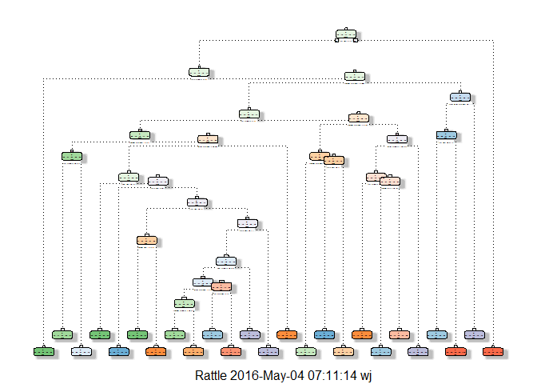

# Quantified Self Movement Prediction
Bill Holst  
April 12, 2016  


## Executive Summary

This project examines a dataset from a group that studies human motion through measurments from accelerometers in fitness devices. 

The goal of this project is to predict the manner in which particpants did the exercise. This is the "classe" variable in the training set. 

The instructions state, "You may use any of the other variables to predict with. You should create a report describing how you built your model, how you used cross validation, what you think the expected out of sample error is, and why you made the choices you did. You will also use your prediction model to predict 20 different test cases."

The site that provided the data offered the following prediction rates:

Detailed Accuracy  
  
Correctly Classified Instances	 164662	 99.4144 %  
Incorrectly Classified Instances	  970	  0.5856 %  
Root mean squared error	0.0463  	
Relative absolute error	0.7938 %	
Relative absolute error	0.7938 %	

Read more about the project and data: http://groupware.les.inf.puc-rio.br/har#ixzz47WrZ8ZhO

## Posing the Question

The goal of this project is to answer the question, "Can measured human motion from accelerometers in fitness devices determine the type of activity subjects are actually doing?"

We know from the website that the answer is yes, with models they developed predicting at 99.4% accuracy. So a better question is, "Can we develop prediction method equivalent to the groupware.les.inf.puc-rio.br site that uses measured human motion from accelerometers in fitness devices determine the type of activity subjects are actually doing?"


## Data Analysis

This section describes the dataset and explains how the data was obtained, how predictors are established, how parameters are picked, and algorithms evaluated.

### Getting and Cleaning the Data

First we need to download and read the data.


```r
setwd("~/GitHub/QuantifiedSelfMotion")
library(caret)
```

```
## Loading required package: lattice
```

```
## Loading required package: ggplot2
```

```r
library(rattle)
```

```
## Warning: package 'rattle' was built under R version 3.2.5
```

```
## Rattle: A free graphical interface for data mining with R.
## Version 4.1.0 Copyright (c) 2006-2015 Togaware Pty Ltd.
## Type 'rattle()' to shake, rattle, and roll your data.
```

```r
library(rpart)
library(rpart.plot)
```

```
## Warning: package 'rpart.plot' was built under R version 3.2.5
```

```r
URLtrain = 'https://d396qusza40orc.cloudfront.net/predmachlearn/pml-training.csv'
trainfile = "pml-training.csv"
if (!file.exists (trainfile)) {
    download.file(URLtrain,destfile="pml-training.csv")
}  
training = read.csv (trainfile,
                         na.strings=c("NA","#DIV/0!",""))

URLtest = 'https://d396qusza40orc.cloudfront.net/predmachlearn/pml-testing.csv'
testfile = "pml-testing.csv"
if (!file.exists ("pml-testing.csv")) {
    download.file(URLtest,destfile="pml-testing.csv")
}  
testing = read.csv(testfile,
                      na.strings=c("NA","#DIV/0!",""))
```

A quick look at the summary shows that many of the variables are sparsely populated, with 19k NA values. We eliminate these.


```r
tnum = NULL

for (i in 1:length(training)) {
  if (sum(is.na(training[,i]))<=19000) {
    tnum = cbind(tnum,i) 
  }
}
# remove the na columns

newtraining = training[,c(tnum)]
newtesting = testing[,c(tnum)]
```

We can also remove the near zero variance variables and other unimportant variables. 


```r
nz = nearZeroVar(newtraining,saveMetrics = TRUE)
#remove the near zero columns

head(newtraining[c(1:8)],2)
```

```
##   X user_name raw_timestamp_part_1 raw_timestamp_part_2   cvtd_timestamp
## 1 1  carlitos           1323084231               788290 05/12/2011 11:23
## 2 2  carlitos           1323084231               808298 05/12/2011 11:23
##   new_window num_window roll_belt
## 1         no         11      1.41
## 2         no         11      1.41
```

Variables like user_name and timestamps do not add anything to our analysis. Also the num_windows variable is a near zero variance variable. Remove the first 7 columns.

Then we split the training data into two separate datasets, a training dataset used to build models, and a validation dataset to test accuracy and out of sample error. The normal split for a mid-sized dataset is .6 training, .4 validation.


```r
trainData = newtraining[,-c(1:7)]
testData= newtesting[,-c(1:7)]

# split our training data into a training and validation set.

set.seed(4151) 
inTraining = createDataPartition(trainData$classe, p = 0.6, list = FALSE)

training = trainData[inTraining,]
validation = trainData[-inTraining,]
```

### Predictors, Parameters, and Algorithms

Because the intended predition is Classe, a factor, a linear regression is not appropriate. Let as look at several other approaches.

First try a classification tree approach. It offers the following advantages:

* Results of a decision tree are easy to interpret, both logically and visually; results can easily be presented to deciscion makers

* There is no need to re-scale the data

* Feature selection / variable screen is automatically provided by the algorithm

* Non-linear relationships are handled by the algorithm automatically


```r
tree = rpart(classe ~ ., data=training, method="class")
fancyRpartPlot(tree)
```

```
## Warning: labs do not fit even at cex 0.15, there may be some overplotting
```



```r
prediction_tree = predict(tree,validation, type = "class")
confusion_tree = confusionMatrix(validation$classe,prediction_tree)

## look at the tree

confusion_tree
```

```
## Confusion Matrix and Statistics
## 
##           Reference
## Prediction    A    B    C    D    E
##          A 1994   74   52   68   44
##          B  279  944  120  109   66
##          C   42   83 1151   74   18
##          D   87  108  189  824   78
##          E   51  127  135   82 1047
## 
## Overall Statistics
##                                        
##                Accuracy : 0.7596       
##                  95% CI : (0.75, 0.769)
##     No Information Rate : 0.3126       
##     P-Value [Acc > NIR] : < 2.2e-16    
##                                        
##                   Kappa : 0.695        
##  Mcnemar's Test P-Value : < 2.2e-16    
## 
## Statistics by Class:
## 
##                      Class: A Class: B Class: C Class: D Class: E
## Sensitivity            0.8129   0.7066   0.6988   0.7122   0.8356
## Specificity            0.9559   0.9118   0.9650   0.9309   0.9401
## Pos Pred Value         0.8934   0.6219   0.8414   0.6407   0.7261
## Neg Pred Value         0.9182   0.9381   0.9234   0.9492   0.9678
## Prevalence             0.3126   0.1703   0.2099   0.1475   0.1597
## Detection Rate         0.2541   0.1203   0.1467   0.1050   0.1334
## Detection Prevalence   0.2845   0.1935   0.1744   0.1639   0.1838
## Balanced Accuracy      0.8844   0.8092   0.8319   0.8216   0.8878
```

The confusion tree suggests an accuracy of 

```r
confusion_tree$overall[1]
```

```
##  Accuracy 
## 0.7596227
```
With this accuracy, there is an out of sample error of around 24%; this probably too high for our intended prediction, based on the website information, which indicates accuracy should be around 99%.

We now investigate other prediction tools, namely random forest and gradient boosting.


```r
fitControl = trainControl(method="cv", number=4, allowParallel=T, verbose=T)
rf = train(classe~.,data=training,method="rf",
trControl=fitControl, verbose=F)            
```

```
## + Fold1: mtry= 2 
## - Fold1: mtry= 2 
## + Fold1: mtry=27 
## - Fold1: mtry=27 
## + Fold1: mtry=52 
## - Fold1: mtry=52 
## + Fold2: mtry= 2 
## - Fold2: mtry= 2 
## + Fold2: mtry=27 
## - Fold2: mtry=27 
## + Fold2: mtry=52 
## - Fold2: mtry=52 
## + Fold3: mtry= 2 
## - Fold3: mtry= 2 
## + Fold3: mtry=27 
## - Fold3: mtry=27 
## + Fold3: mtry=52 
## - Fold3: mtry=52 
## + Fold4: mtry= 2 
## - Fold4: mtry= 2 
## + Fold4: mtry=27 
## - Fold4: mtry=27 
## + Fold4: mtry=52 
## - Fold4: mtry=52 
## Aggregating results
## Selecting tuning parameters
## Fitting mtry = 27 on full training set
```

```r
prediction_rf = predict(rf, validation)
confusion_rf = confusionMatrix(validation$classe,prediction_rf)
confusion_rf
```

```
## Confusion Matrix and Statistics
## 
##           Reference
## Prediction    A    B    C    D    E
##          A 2224    5    1    0    2
##          B   12 1502    4    0    0
##          C    0    9 1354    5    0
##          D    0    1   23 1260    2
##          E    0    1    4    8 1429
## 
## Overall Statistics
##                                           
##                Accuracy : 0.9902          
##                  95% CI : (0.9877, 0.9922)
##     No Information Rate : 0.285           
##     P-Value [Acc > NIR] : < 2.2e-16       
##                                           
##                   Kappa : 0.9876          
##  Mcnemar's Test P-Value : NA              
## 
## Statistics by Class:
## 
##                      Class: A Class: B Class: C Class: D Class: E
## Sensitivity            0.9946   0.9895   0.9769   0.9898   0.9972
## Specificity            0.9986   0.9975   0.9978   0.9960   0.9980
## Pos Pred Value         0.9964   0.9895   0.9898   0.9798   0.9910
## Neg Pred Value         0.9979   0.9975   0.9951   0.9980   0.9994
## Prevalence             0.2850   0.1935   0.1767   0.1622   0.1826
## Detection Rate         0.2835   0.1914   0.1726   0.1606   0.1821
## Detection Prevalence   0.2845   0.1935   0.1744   0.1639   0.1838
## Balanced Accuracy      0.9966   0.9935   0.9874   0.9929   0.9976
```

```r
# Try gradient boosting

gbm = train(classe~.,data=training,method="gbm",
    trControl=fitControl, verbose=F)    
```

```
## + Fold1: shrinkage=0.1, interaction.depth=1, n.minobsinnode=10, n.trees=150 
## - Fold1: shrinkage=0.1, interaction.depth=1, n.minobsinnode=10, n.trees=150 
## + Fold1: shrinkage=0.1, interaction.depth=2, n.minobsinnode=10, n.trees=150 
## - Fold1: shrinkage=0.1, interaction.depth=2, n.minobsinnode=10, n.trees=150 
## + Fold1: shrinkage=0.1, interaction.depth=3, n.minobsinnode=10, n.trees=150 
## - Fold1: shrinkage=0.1, interaction.depth=3, n.minobsinnode=10, n.trees=150 
## + Fold2: shrinkage=0.1, interaction.depth=1, n.minobsinnode=10, n.trees=150 
## - Fold2: shrinkage=0.1, interaction.depth=1, n.minobsinnode=10, n.trees=150 
## + Fold2: shrinkage=0.1, interaction.depth=2, n.minobsinnode=10, n.trees=150 
## - Fold2: shrinkage=0.1, interaction.depth=2, n.minobsinnode=10, n.trees=150 
## + Fold2: shrinkage=0.1, interaction.depth=3, n.minobsinnode=10, n.trees=150 
## - Fold2: shrinkage=0.1, interaction.depth=3, n.minobsinnode=10, n.trees=150 
## + Fold3: shrinkage=0.1, interaction.depth=1, n.minobsinnode=10, n.trees=150 
## - Fold3: shrinkage=0.1, interaction.depth=1, n.minobsinnode=10, n.trees=150 
## + Fold3: shrinkage=0.1, interaction.depth=2, n.minobsinnode=10, n.trees=150 
## - Fold3: shrinkage=0.1, interaction.depth=2, n.minobsinnode=10, n.trees=150 
## + Fold3: shrinkage=0.1, interaction.depth=3, n.minobsinnode=10, n.trees=150 
## - Fold3: shrinkage=0.1, interaction.depth=3, n.minobsinnode=10, n.trees=150 
## + Fold4: shrinkage=0.1, interaction.depth=1, n.minobsinnode=10, n.trees=150 
## - Fold4: shrinkage=0.1, interaction.depth=1, n.minobsinnode=10, n.trees=150 
## + Fold4: shrinkage=0.1, interaction.depth=2, n.minobsinnode=10, n.trees=150 
## - Fold4: shrinkage=0.1, interaction.depth=2, n.minobsinnode=10, n.trees=150 
## + Fold4: shrinkage=0.1, interaction.depth=3, n.minobsinnode=10, n.trees=150 
## - Fold4: shrinkage=0.1, interaction.depth=3, n.minobsinnode=10, n.trees=150 
## Aggregating results
## Selecting tuning parameters
## Fitting n.trees = 150, interaction.depth = 3, shrinkage = 0.1, n.minobsinnode = 10 on full training set
```

```r
prediction_gbm = predict(gbm, validation)
confusion_gbm = confusionMatrix(validation$classe,prediction_gbm)
```
The gbm model performs well, with accuracy of almost 96%, slightly less than the random forest. 

The model that seems to perform best is random forest, with accuracy of 99% and out of sample error of 1%.

## Prediction

We now have use our random forest model to predict values for submission to the automated grading system. The submission is 


```r
testPrediction_rf = predict(rf, testData)
```

```
## Loading required package: randomForest
```

```
## Warning: package 'randomForest' was built under R version 3.2.5
```

```
## randomForest 4.6-12
```

```
## Type rfNews() to see new features/changes/bug fixes.
```

```
## 
## Attaching package: 'randomForest'
```

```
## The following object is masked from 'package:ggplot2':
## 
##     margin
```

Per the Coursera Honor Code, the results of this prediction are not published here, but have been submitted to the automated prediction quiz grading process. FYI, the test prediction was 20/20. 

## Summary

This study examines several appropriate models for the prediction of types of human motion from accelerometers in fitness devices. Evaluation of several models show that the random forest serves as the most accurate prediction model. Of course, there is a possibility of overfitting, but random forest trys to reduce this via tuning the number of features used in cross validation. The results obtained in this study are equivalent to those obtatined in the original groupware study.     

## References

 * Data Usage: Ugulino, W.; Cardador, D.; Vega, K.; Velloso, E.; Milidiu, R.; Fuks, H. Wearable Computing: Accelerometers' Data Classification of Body Postures and Movements. Proceedings of 21st Brazilian Symposium on Artificial Intelligence. Advances in Artificial Intelligence - SBIA 2012. In: Lecture Notes in Computer Science. , pp. 52-61. Curitiba, PR: Springer Berlin / Heidelberg, 2012. ISBN 978-3-642-34458-9. DOI: 10.1007/978-3-642-34459-6_6. 

 * Article on decision tree advantages: http://www.simafore.com/blog/bid/62333/4-key-advantages-of-using-decision-trees-for-predictive-analytics

* Read more: http://groupware.les.inf.puc-rio.br/har#sbia_paper_section#ixzz46fnQWmUP
